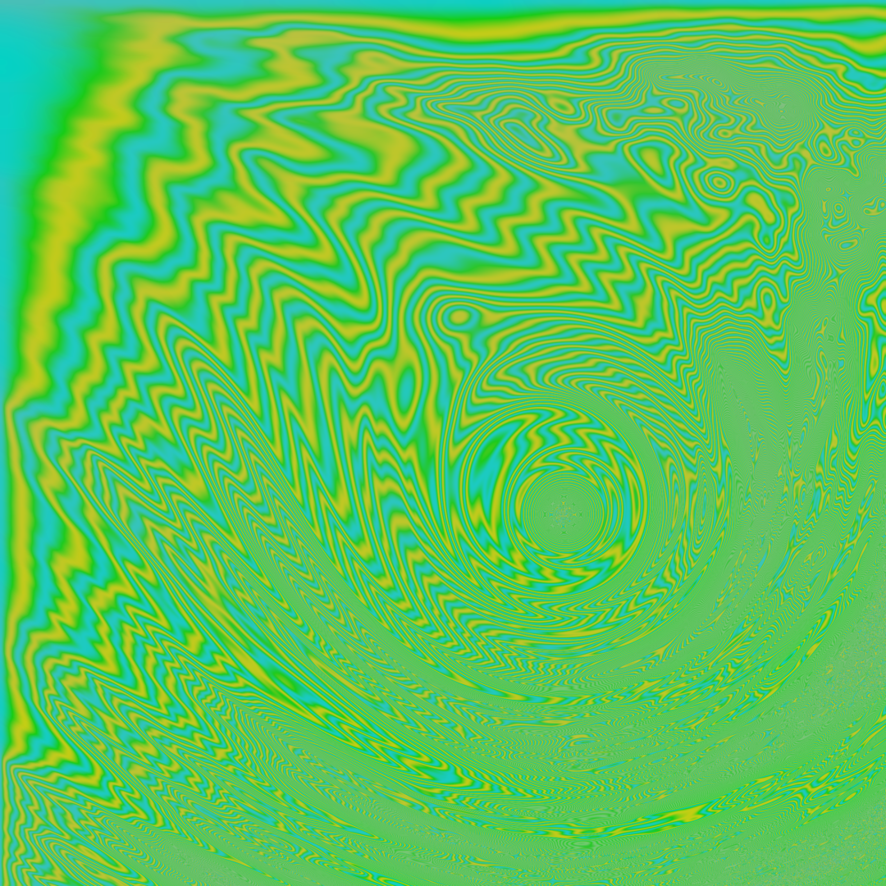

+++
title = "Tie Dye Clouds"
categories = ["Sketch"]
description = "Distorted vector field of tie dye colours."
featured_image = "images/swirl-9.png"
date = '2019-10-09'
draft = false
+++


One of my favourite techniques for creating generative graphics are flow fields or vector fields. In the simplest terms this is the act of taking a grid of point, pixels, or euclidean vectors, and modifying them in some way based on their position on the canvas. Read more about [vector fields](https://en.wikipedia.org/wiki/Vector_field).

In this case I'm using each pixel on the canvas as point in the vector field. Taking each pixels vector position I'm setting it's colour based on a series of calculations and noise.

Here's a series of outputs showing my progress to get from a basic noise field to a more interesting design.











asdf

